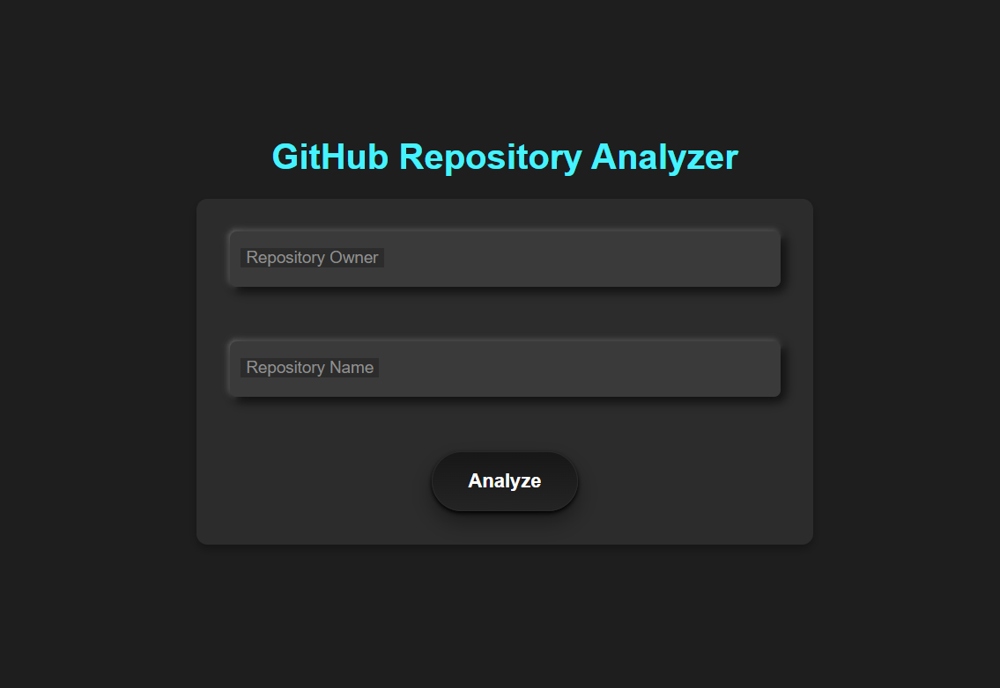
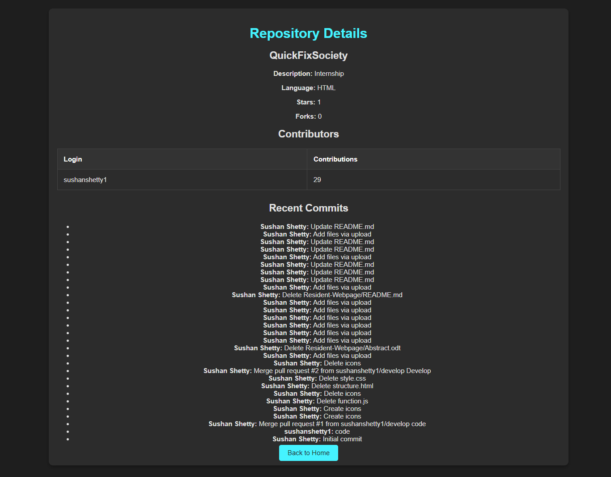

# GitHub Analyzer Tool


Welcome to *GitHub Analyzer Tool*! This powerful tool allows you to analyze GitHub repositories with ease, providing insights into repository statistics, contributors, and more.

<p align="center">
  
  
</p>

## Table of Contents

- [Introduction](#introduction)
- [Features](#features)
- [Installation](#installation)
- [Usage](#usage)
- [Contributing](#contributing)
- [License](#license)
- [Contact](#contact)

## Introduction

*GitHub Analyzer Tool* is designed to help you gain valuable insights into GitHub repositories. It provides detailed statistics about repositories, including contributor information, issue tracking, and more. Perfect for developers, analysts, and anyone interested in GitHub data.

## Features

- 📊 *Repository Statistics*: Get detailed statistics about the repository.
- 🧑‍🤝‍🧑 *Contributor Analysis*: View and analyze the contributors of the repository.
- 📝 *Issue Tracking*: Track and analyze issues within the repository.
- 📈 *Visual Insights*: Graphical representations of data, including pie charts and tables.

## Installation

To get started with *GitHub Analyzer Tool*, follow these steps:

1. *Clone the repository:*

   ```bash
   git clone https://github.com/sushanshetty1/github-analyzer-tool.git
   

2. *Navigate to the project directory:*

   ```bash
   cd github-analyzer-tool
   

3. *Install dependencies:*

   ```bash
   npm install
   

4. *Run the project:*

   ```bash
   npm start
   

## Usage

To analyze a GitHub repository, use the following steps:

1. Open the application.
2. Enter the GitHub repository owner and name in the input fields.
3. Click on the *Analyze* button to view the results.

*Example Usage:*

```bash
# Start the tool
npm start

# Open the application in your browser
http://localhost:3000

# Enter the repository owner and name, then click Analyze
```

Refer to the [documentation](https://github.com/sushanshetty1/github-analyzer-tool/wiki) for more detailed usage instructions.

## Contributing

We welcome contributions to *GitHub Analyzer Tool*! If you want to contribute, please follow these guidelines:

1. Fork the repository.
2. Create a new branch (git checkout -b feature/your-feature).
3. Commit your changes (git commit -am 'Add new feature').
4. Push to the branch (git push origin feature/your-feature).
5. Open a Pull Request.

For more details, check our [contributing guidelines](CONTRIBUTING.md).

## License

This project is licensed under the [MIT License](LICENSE). See the [LICENSE](LICENSE) file for more information.

## Contact

If you have any questions, feel free to reach out:

- *Email*: [sushanshetty1470@gmail.com](mailto:sushanshetty1470@gmail.com)

---

Thank you for visiting *GitHub Analyzer Tool*! We hope you find it useful and look forward to your contributions.

---

### Design Elements

- *Consistency*: Ensure the use of consistent colors, fonts, and styles throughout the document.
- *Images*: Use high-quality images and screenshots to showcase features.
- *Alignment*: Properly align text and images for a clean look.
- *Whitespace*: Use whitespace effectively to avoid clutter.

### Credits

The UI/UX design of this project was inspired by components from [uiverse.io](https://uiverse.io/).
